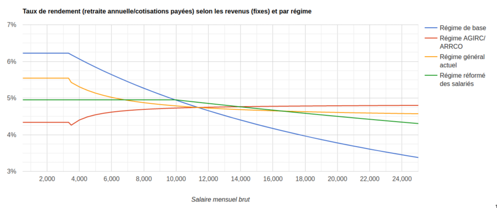

# Comparaison du régime général des salariés au régime proposé par la réforme

## Un tout de petit peu de maths

Voici grossièrement les 2 fonctions avec les paramètres de base de la retraite des salariés :

- `retraite du système actuel = f1(date de naissance, nombre de trimestres validés, évolution de salaire -> 25 meilleures années, exceptions) + f2(évolution du salaire sur toute la carrière - déjà basé sur des points)`
  - f1 est la fonction du régime de base, f2 est la fonction du régime complémentaire AGIRC/ARRCO
  - retraite minimum
  - pénibilité
  - carrière longue
- `retraite réforme = g(évolution du salaire sur toute la carrière, exceptions)`
  - retraite minimum
  - pénibilité
  - carrière longue

Creusons un peu ces différentes fonctions.

## Fonction de calcul de la retraite du système actuel

Définissons tout de suite une variable importante : le PASS (Plafond Annuel de la Sécurité Sociale ~40k€).

`retraite de base = salaire moyen des 25 meilleures années * taux de pension * nombre de trimestres validés / nombre de trimestres requis`

- à noter que cette formule est indépendante du montant des cotisations versées, qui sont linéaires jusqu'au PASS (appelé taux plafonné). Un taux "déplafonné" (sans limite) s'applique à toute la rémunération (2.3%)
- salaire moyen des 25 meilleures années : tiens compte des primes et des heures supplémentaires (même si exonérations de cotisations...), mais /!\ plafonné au PASS
- taux de pension : 50% - décôte fonction du nombre de trimestres validés manquants (jusqu'à 37,5% pour 20 trimestres manquants)
- nombres de trimestres validés : pour valider un trimestre, il faut avoir cotisé au moins à hauteur de 150 SMIC horaires (soit environ 1/3 temps), le chômage indemnisé permettant de valider des trimestres (mais plus lorsqu'on n'est plus indemnisé).

Impacts :

- toute carrière incomplète est doublement pénalisée : par le taux de pension et par le nombre de trimestres manquants (via ratio validés / requis), sauf à attendre l'âge de départ à taux plein sans conditions (67 ans si né après 1973, [cf. détails](https://www.service-public.fr/particuliers/vosdroits/F14044))
- par contre, le salaire moyen des 25 meilleures années n'est pas impacté par une carrière incomplète (car si moins de 25 ans de carrière, la moyenne est faite sur toutes ces années)
- un salaire supérieur au PASS fait qu'on cotise légèrement plus sans avoir de droits supplémentaires, c'est une mesure contributive au financement du système
  - Inutile de crier à l'innovation avec le taux contributif de 2,81% de la réforme...ça existe déjà!

`retraite complémentaire = nombre de points * valeur de service du point * majoration/minoration selon âge/trimestres validés`, avec `nombre de points = cotisations rapportant des points / 127% / valeur d'achat du point`

- c'est un système à points (par répartition, j'insiste : les cotisations paient les pensions des retraités)
- cotisations : les cotisations ne sont pas linéaires, les taux de cotisations dépendent de la rémunération, on distingue 2 tranches : la première jusqu'au PASS, la second entre le PASS et 8 PASS (~320k€). Au dessus de 8 PASS, plus aucune cotisation et du coup pas de droits supplémentaires.
- cotisations rapportant des points ou non : une partie des cotisations ne rapportent pas de points (supporté par tous)
- 127% : c'est un taux qui réduit le nombre de points obtenus (mis en place pour contribuer au financement de l'équilibre de l'AGIRC/ARRCO), cela revient à augmenter la valeur d'achat du point...
- valeur d'achat du point et valeur de service du point : la valeur d'achat donne un nombre de points pour chaque euro cotisé, la valeur de service donne un montant de pension brute annuelle par points. Ces valeurs sont réévaluées annuellement par les partenaires sociaux gestionnaires de l'AGIRC-ARRCO ([cf. historique](https://www.agirc-arrco.fr/fileadmin/agircarrco/documents/Doc_specif_page/Historique_valeur_du_point_salaire_de_reference.pdf))
- majoration/minoration selon âge/trimestres validés : tout comme la retraite de base, il y a une décôte pour trimestres manquants jusqu'à 20 trimestres (qui peut être limitée en se rapprochant de l'âge de départ à taux plein - 67 ans > 1955, [cf. coefficients](https://www.agirc-arrco.fr/fileadmin/agircarrco/documents/Doc_specif_page/Coefficients_danticipation_carrieres_courtes.pdf))

Impacts :

- une carrière incomplète est impactée par la minoration liée aux nombres de trimestres manquants, sauf à repousser son départ pour se rapprocher de l'âge de départ à taux plein : c'est une incitation à partir le plus tard possible
- elle est aussi impactée par le fait d'avoir engrangé moins de points
- les retraites versées sont directement proportionnelles aux cotisations payées, donc tant que la répartition des salaires reste équivalente dans le temps, personne ne contribue plus ou moins au financement du système
- par contre, les taux de cotisations étant bien supérieurs entre 1 et 8 PASS qu'en dessous du PASS, si la part des salaires supérieurs au PASS baisse en proportion de la population du régime, alors l'équilibre du régime par répartition est mis en jeu. Par exemple, 10% d'actifs au-dessus du PASS + 5% d'actifs en-dessous du PASS ne peuvent pas payer 15% de retraités qui ont cotisés au dessus du PASS, car les 5% d'actifs en dessous du PASS cotisent beaucoup moins que ce qu'il faut verser en retraite. Inversement, le régime peut être bénéficaire par une augmentation de la part des salaires supérieurs au PASS.

## Fonction de calcul de la retraite selon la réforme de 2019-2020

Nous appelerons ce régime le "régime réformé" pour faire court.

`retraite réformé = nombre de points * valeur de service du point * majoration/minoration selon âge/trimestres validés`, avec `nombre de points = cotisations rapportant des points / valeur d'achat du point`

C'est en fait exactement la même formule que le régime AGIRC/ARRCO mais avec des paramètres différents :

- valeurs de points différentes, pas de ratio à 127% (on verra comment comparer ci-après) : indexées sur l'évolution des salaires, gérés par les partenaires sociaux (les mêmes que l'AGIRC/ARRCO ?)
- majoration/minoration selon âge/trimestres : l'âge pivot/d'équilibre (tant discuté - à 64 ans) limite la décote à 10% en partant à 62 ans, et permet une surcote de 5% par an dès 65 ans
- cotisations : un taux unique pour tous jusqu'à 3 PASS, un taux déplafonné ne rapportant pas de points à 2.81%, la somme des 2 taux induisant les mêmes cotisations que dans le système actuel jusqu'à 3 PASS, mais seulement 2.8% entre 3 PASS et 8 PASS
- minimum retraite net à 85% du SMIC net pour une carrière complète (basée sur 43 annuités = 172 trimestres)

## Comparaison

Pour comparer les régimes de retraites, plusieurs indicateurs peuvent être utilisés et l'objectif est d'éviter de ne montrer que celui qui ne fait dire que ce qu'on veut.

### Taux de rendement

Il est assez simple de comparer le régime réformé et le régime complémentaire AGIRC/ARRCO puisqu'ils ont des fonctions semblables, il suffit de comparer les paramètres :

- pour comparer les valeurs de points, on utilise le `taux de rendement = valeur de service du point / valeur d'achat du point`, ou aussi à partir de la formule `taux de rendement = retraite annuelle / cotisations totales rapportant des points`, ce qui donne les valeurs types de 5.5% pour la réforme **versus** 5.75% pour l'AGIRC/ARRCO (il faut tenir compte du ratio de 127% pour être équivalent)
- cependant, ce taux de rendement est "brut" car il ne tient pas compte des cotisations qui ne donnent pas de points, mais qui emputent le `taux de rendement net = retraite annuelle / cotisations totales (y compris celles ne rapportant pas de points)`, dans ce cas, le taux de rendement tombe à 4.95% pour la réforme **versus** 4.52% pour l'AGIRC/ARRCO uniquement en dessous du PASS, le taux AGIRC/ARRCO remontant jusqu'à 5% à 8 PASS, alors que le taux de la réforme baisse dès 3 PASS. Pour 3 PASS, l'AGIRC/ARRCO est à 4.92% soit quasiment équivalent à la réforme.

Elargissons la comparaison au régime général dans son ensemble, en comparant le taux de rendement global. Avec la formule élargie du taux de rendement net ci-dessus, nous pouvons calculer le taux de rendement du régime de base actuel, bien qu'il dépende alors beaucoup de la variation de revenus sur l'ensemble de la carrière (en raison de la régle des 25 meilleures années). Voici une première comparaison des régimes actuels et prévus pour des revenus fixes :

